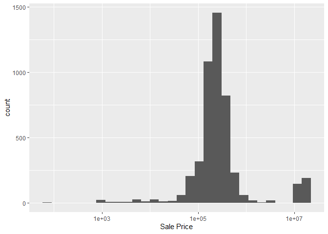
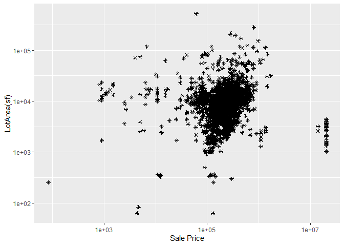
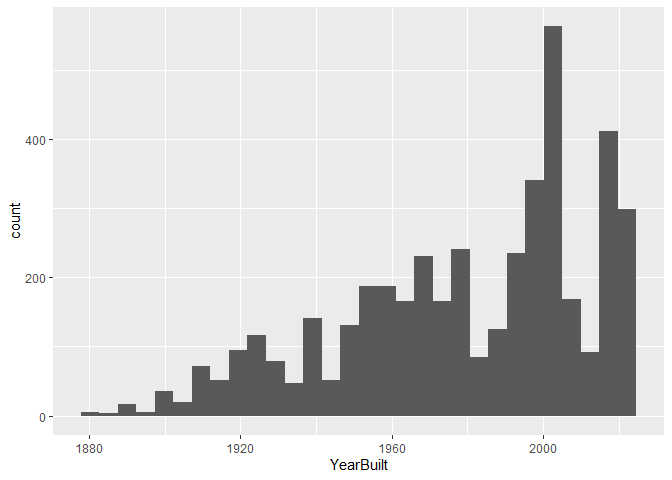
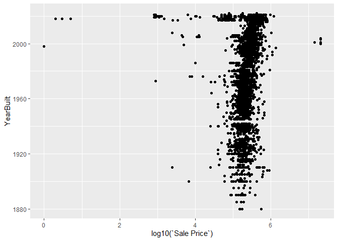
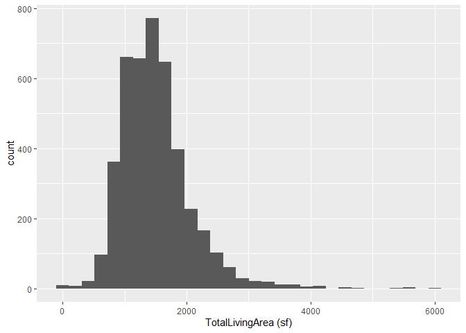
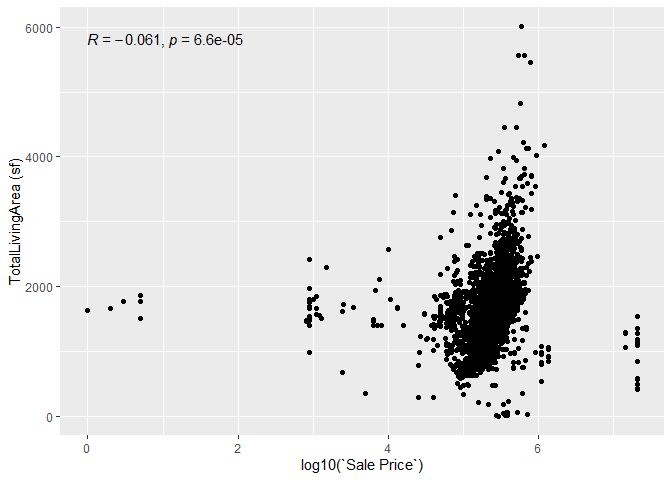
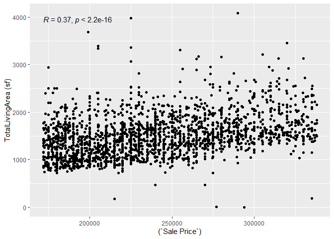
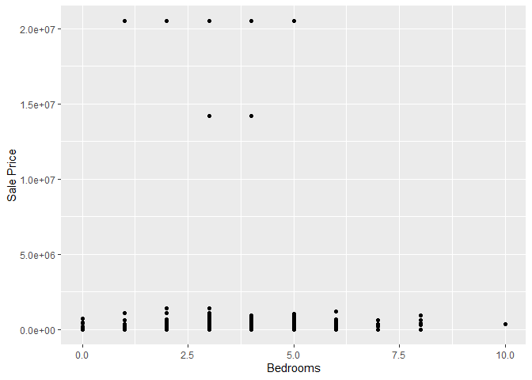
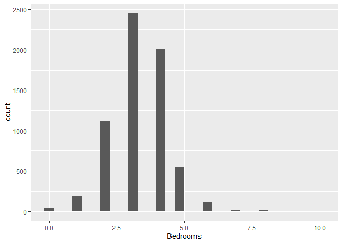

<!-- README.md is generated from README.Rmd. Please edit the README.Rmd file -->

# Lab report \#1

Follow the instructions posted at
<https://ds202-at-isu.github.io/labs.html> for the lab assignment. The
work is meant to be finished during the lab time, but you have time
until Monday evening to polish things.

Include your answers in this document (Rmd file). Make sure that it
knits properly (into the md file). Upload both the Rmd and the md file
to your repository.

All submissions to the github repo will be automatically uploaded for
grading once the due date is passed. Submit a link to your repository on
Canvas (only one submission per team) to signal to the instructors that
you are done with your submission.

``` r
# install.packages("classdata")
# install.packages("ggplot2")
library(ggplot2)
```

    ## Warning: package 'ggplot2' was built under R version 4.4.2

``` r
library(dplyr)
```

    ## Warning: package 'dplyr' was built under R version 4.4.2

    ## 
    ## Attaching package: 'dplyr'

    ## The following objects are masked from 'package:stats':
    ## 
    ##     filter, lag

    ## The following objects are masked from 'package:base':
    ## 
    ##     intersect, setdiff, setequal, union

``` r
library(classdata)
ames
```

    ## # A tibble: 6,935 × 16
    ##    `Parcel ID` Address     Style Occupancy `Sale Date` `Sale Price` `Multi Sale`
    ##    <chr>       <chr>       <fct> <fct>     <date>             <dbl> <chr>       
    ##  1 0903202160  1024 RIDGE… 1 1/… Single-F… 2022-08-12        181900 <NA>        
    ##  2 0907428215  4503 TWAIN… 1 St… Condomin… 2022-08-04        127100 <NA>        
    ##  3 0909428070  2030 MCCAR… 1 St… Single-F… 2022-08-15             0 <NA>        
    ##  4 0923203160  3404 EMERA… 1 St… Townhouse 2022-08-09        245000 <NA>        
    ##  5 0520440010  4507 EVERE… <NA>  <NA>      2022-08-03        449664 <NA>        
    ##  6 0907275030  4512 HEMIN… 2 St… Single-F… 2022-08-16        368000 <NA>        
    ##  7 0535105180  511 25TH S… 1 St… Single-F… 2022-08-03             0 <NA>        
    ##  8 0907428446  4510 TWAIN… 1 St… Condomin… 2022-08-16        110000 <NA>        
    ##  9 0527301030  3409 EISEN… 1 St… Single-F… 2022-08-08        350000 <NA>        
    ## 10 0531363050  5426 KANSA… 1 St… Single-F… 2022-08-03        242000 <NA>        
    ## # ℹ 6,925 more rows
    ## # ℹ 9 more variables: YearBuilt <dbl>, Acres <dbl>,
    ## #   `TotalLivingArea (sf)` <dbl>, Bedrooms <dbl>,
    ## #   `FinishedBsmtArea (sf)` <dbl>, `LotArea(sf)` <dbl>, AC <chr>,
    ## #   FirePlace <chr>, Neighborhood <fct>

``` r
ames <- ames
```

*Step 1* The variables contain strings, dates, and various pertinent
numeric information. -Parcel ID is the unique variable to identify the
building that was sold. - Address is the address. - Style contains the
number of stories in a housewith other relevant information. - Occupancy
addresses the housing density. - Sale Date is the date the house was
sold. - Sale Price is the main variable; it’s how much the house sold
for. - Year Built is the year each building was made. - Acres is the
property’s acreage.

*Step 2* The main variable seems to be the price; most people care a lot
more about the price than any other feature when purchasing a building.

*Step 3*

``` r
  ames2 <- ames %>% filter(`Sale Price` > 10, na.rm = TRUE)
  ggplot(ames2, aes(x = `Sale Price`)) + geom_histogram() + scale_x_log10()
```

<!-- -->

*Step 4* Naomi will analyze the relationship between house cost and
total living area. Brandon will analyze the relationship between house
cost and year built. Cole will analyze the relationship between house
cost and acreage. Cameron will analyze the relationship between housing
cost and bedrooms

``` r
ames3 <- ames2 %>% filter(`LotArea(sf)` > 10, na.rm = TRUE)
  ggplot(ames3, aes(x = `Sale Price`, y = `LotArea(sf)`)) + scale_x_log10() + geom_point(shape = 8) + scale_y_log10()
```

<!-- --> *Step 4(Cole
Flickinger)* The range itself is homes within the cost of a few hundred
dollars all the way to a few million dollars with square footages
spanning from a couple hundred square feet all the way up to the tens of
thousands. Notably, the houses appear to mostly cost around upwards of
\$100,000 while the square footage seems to often be a little less than
10,000 square foot with a few outlier houses going for around the same
cost. There is not as strong of an upward trend of housing cost in
comparison to square-footage as I initially expected. This does explain
the extremely low cost house by itself in the graph that was shown
during the histogram. Notably, making sense that this low cost house
would also have an extremely small square-footage.

``` r
amesAge <- ames %>% filter(YearBuilt > 0, `Sale Price` > 0)
ggplot(amesAge, aes(x = YearBuilt)) + geom_histogram()
```

<!-- -->

``` r
ggplot(amesAge, aes(x = log10(`Sale Price`), y = YearBuilt)) + geom_point()
```

<!-- -->  
Brandon Merrick Step 4: The Year Built ranges from about 1880 to 2020
with more houses generally existing for later years.  
There appears to only be a small effect when comparing Age to Price
where the majority cluster around the same area and newer houses having
more variability to both be above and below average  
This does not seem to describe any oddities  

``` r
#install.packages("ggpubr")
library(ggpubr)
```

    ## Warning: package 'ggpubr' was built under R version 4.4.3

``` r
amesArea <- ames %>% filter(`TotalLivingArea (sf)` > 0, `Sale Price` > 0)
ggplot(amesArea, aes(x = `TotalLivingArea (sf)`)) + geom_histogram()
```

<!-- -->

``` r
ggplot(amesArea, aes(x = log10(`Sale Price`), y = `TotalLivingArea (sf)`)) + geom_point() + stat_cor()
```

<!-- -->

``` r
amesArea2 <- ames %>% filter(`TotalLivingArea (sf)` > 0, `Sale Price` > 171975, `Sale Price` < 338088)
ggplot(amesArea2, aes(x = (`Sale Price`), y = `TotalLivingArea (sf)`)) + geom_point() + stat_cor()
```

<!-- -->

``` r
summary(amesArea)
```

    ##   Parcel ID           Address                        Style     
    ##  Length:4288        Length:4288        1 Story Frame    :2498  
    ##  Class :character   Class :character   2 Story Frame    : 980  
    ##  Mode  :character   Mode  :character   1 1/2 Story Frame: 460  
    ##                                        Split Level Frame: 140  
    ##                                        Split Foyer Frame: 107  
    ##                                        2 1/2 Story Frame:  57  
    ##                                        (Other)          :  46  
    ##                           Occupancy      Sale Date            Sale Price      
    ##  Condominium                   : 572   Min.   :2017-07-03   Min.   :       1  
    ##  Single-Family / Owner Occupied:3117   1st Qu.:2019-04-16   1st Qu.:  171975  
    ##  Townhouse                     : 430   Median :2020-10-14   Median :  234550  
    ##  Two-Family Conversion         :  76   Mean   :2020-06-29   Mean   : 1608420  
    ##  Two-Family Duplex             :  93   3rd Qu.:2021-11-05   3rd Qu.:  338088  
    ##                                        Max.   :2022-08-31   Max.   :20500000  
    ##                                                                               
    ##   Multi Sale          YearBuilt        Acres        TotalLivingArea (sf)
    ##  Length:4288        Min.   :1880   Min.   :0.0000   Min.   :   3        
    ##  Class :character   1st Qu.:1957   1st Qu.:0.1380   1st Qu.:1108        
    ##  Mode  :character   Median :1986   Median :0.2120   Median :1455        
    ##                     Mean   :1979   Mean   :0.2376   Mean   :1504        
    ##                     3rd Qu.:2004   3rd Qu.:0.2680   3rd Qu.:1757        
    ##                     Max.   :2022   Max.   :4.6500   Max.   :6007        
    ##                                    NA's   :2                            
    ##     Bedrooms      FinishedBsmtArea (sf)  LotArea(sf)          AC           
    ##  Min.   : 0.000   Min.   :  16.0        Min.   :     0   Length:4288       
    ##  1st Qu.: 3.000   1st Qu.: 480.0        1st Qu.:  6000   Class :character  
    ##  Median : 3.000   Median : 724.5        Median :  9240   Mode  :character  
    ##  Mean   : 3.318   Mean   : 766.0        Mean   : 10348                     
    ##  3rd Qu.: 4.000   3rd Qu.:1000.0        3rd Qu.: 11677                     
    ##  Max.   :10.000   Max.   :2537.0        Max.   :202554                     
    ##                   NA's   :1548          NA's   :2                          
    ##   FirePlace                            Neighborhood 
    ##  Length:4288        (27) Res: N Ames         : 508  
    ##  Class :character   (37) Res: College Creek  : 502  
    ##  Mode  :character   (57) Res: Investor Owned : 417  
    ##                     (29) Res: Old Town       : 285  
    ##                     (34) Res: Edwards        : 276  
    ##                     (19) Res: North Ridge Hei: 215  
    ##                     (Other)                  :2085

*Step 4 Naomi Mauss* The minimum living area is 3 square feet, and the
maximum living area is 6,007 square feet. The mean is 1,504 and the
median is 1,455. A histogram shows the distribution of living area sizes
skews right, with a longer tail on the right than on the left. The
correlation coefficient is -0.061, which is very weak. Additionally, a
negative correlation between the cost of a house and the building’s
square footage seems unlikely. In comparing sale price to total living
area, there is an wide range of prices, even after applying a log
function. Outliers could explain the unexpected correlation coefficient,
so it makes sense to have another graph which considers more average
variables The 1st quartile sale price is 171975, and the 3rd quartile is
338088. When considering only houses whose price is within the
interquartile range, the correlation coefficient is 0.37. This makes
more sense, as it is expected for a bigger house to cost more money, and
there is not a weak correlation coefficient.

*Step 4 Cameron Kraklio* The minimum number of bedrooms is zero,
possibly a data error or apartment. The max is 10 with a median of 3. As
partial bedrooms wouldn’t make sense the mean isn’t as helpful in this
case, although it being higher than the median helps to show how the
data is skewed right.Homes with more than 5 bedrooms were rare with 10
bedrooms being an outlier. Also interestingly nough more bedrooms didn’t
always indicate a higher price as some outlier high sale price homes had
a relativly low bedroom count

``` r
range(ames$Bedrooms, na.rm = TRUE)
```

    ## [1]  0 10

``` r
range(ames$`Sale Price`, na.rm = TRUE)
```

    ## [1]        0 20500000

``` r
summary(ames$Bedrooms)
```

    ##    Min. 1st Qu.  Median    Mean 3rd Qu.    Max.    NA's 
    ##   0.000   3.000   3.000   3.299   4.000  10.000     447

``` r
ggplot(ames, aes(x = `Bedrooms`, y = `Sale Price`)) + geom_point()
```

    ## Warning: Removed 447 rows containing missing values or values outside the scale range
    ## (`geom_point()`).

<!-- -->

``` r
ggplot(ames, aes(x = `Bedrooms`)) + geom_histogram()
```

    ## Warning: Removed 447 rows containing non-finite outside the scale range
    ## (`stat_bin()`).

<!-- -->
